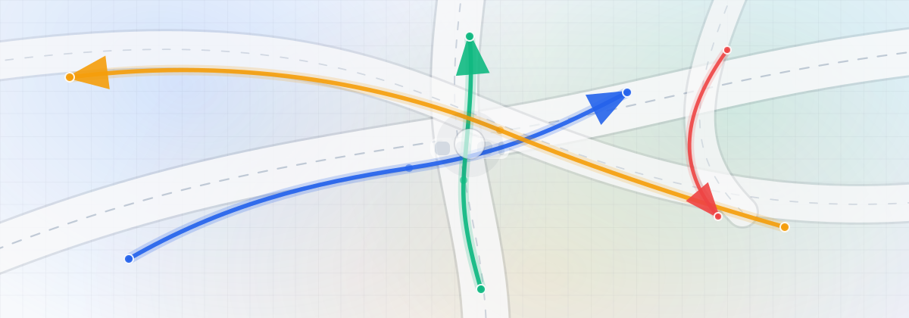

# V2X Scene Explorer

Maintainer: Hassan

V2X Scene Explorer is a lightweight, dependency-free web app for exploring multi-agent trajectory datasets:
scene browsing, playback, full trajectories, per-class filters, and HD map rendering when available.



## Features

- Dataset picker with per-dataset settings (saved locally in your browser)
- Scene navigation (next/prev, jump to scene ID)
- Split-level availability summary (scene counts per modality)
- Playback (play/pause, next frame, speed control)
- Visual layers: trajectories, velocity arrows, heading arrows
- Filters: modality/stream, object type, and fine-grained classes (subtypes)
- HD map layers (lanes/stoplines/crosswalks/junction areas) for datasets that provide maps

## Quick start

### Requirements

- Python 3.10+ (backend uses only the Python standard library)

### `dev.sh` launcher

Use the root launcher script for common workflows:

```bash
./dev.sh            # same as: ./dev.sh web
./dev.sh web        # run web app with auto-reload (HOST=127.0.0.1, PORT=8000)
./dev.sh desktop    # run native macOS desktop app (dev mode)
./dev.sh build      # build dist/V2X Scene Explorer.app
./dev.sh dmg        # build dist/V2X Scene Explorer.dmg
./dev.sh help       # show all options
```

Optional web env vars:

```bash
HOST=127.0.0.1 PORT=9000 ./dev.sh web
```

### 1) Configure datasets (not included in this repo)

Datasets are intentionally not committed to GitHub (they are large). After downloading a dataset locally,
you can connect them directly from the app home page:

- Open **Connect Local Dataset**
- Choose dataset type (or Auto detect)
- Paste one or more local paths
- Click **Detect + Validate** then **Save Connection**

Connections are stored per-user and can use custom folder structures.

Fallback/manual config is still supported by editing `dataset/registry.json` and setting each dataset `root`.

Default expected locations (recommended):

- `dataset/v2x-traj/` (V2X-Traj dataset root)
- `dataset/Consider-It/` (Consider.it CPM Objects dataset root)

### 2) Run the server

From the repo root:

```bash
python3 -m apps.server.server --port 8000
```

Dev mode (auto-restart the backend when Python files change):

```bash
python3 -m apps.server.server --port 8000 --reload
```

Then open:

- http://127.0.0.1:8000

### 3) Run as a native macOS desktop app (local dev)

From the repo root:

```bash
python3 -m pip install -r desktop/requirements-macos.txt
python3 -m apps.desktop.main
```

The desktop launcher starts the same backend and opens a native macOS window.
It auto-creates a user-local dataset override file at:

- `~/Library/Application Support/V2X Scene Explorer/registry.local.json`

Use that file to set your local dataset paths without editing files inside the app bundle.

### 4) Build a distributable `.app` bundle (macOS)

```bash
./desktop/build_macos_app.sh
```

Output:

- `dist/V2X Scene Explorer.app`

For public distribution, sign + notarize the app with your Apple Developer ID.

App icon notes:

- The build auto-generates `desktop/assets/app-icon-source.png` if it does not exist.
- You can override icon source per build:

```bash
ICON_SRC="/absolute/path/to/your-icon.png" ./desktop/build_macos_app.sh
```

### 5) Package a `.dmg` installer (macOS)

```bash
./desktop/build_macos_dmg.sh
```

Output:

- `dist/V2X Scene Explorer.dmg`

### 6) Sign + notarize for public distribution (macOS)

Prerequisite: Apple Developer account with a `Developer ID Application` certificate installed.

List available signing identities:

```bash
security find-identity -v -p codesigning
```

Set your signing identity:

```bash
export DEV_ID_APP="Developer ID Application: YOUR NAME (TEAMID)"
```

Sign the app:

```bash
./desktop/sign_macos_app.sh
```

Create a notarytool keychain profile (recommended, one-time setup):

```bash
xcrun notarytool store-credentials "V2X_NOTARY" \
  --apple-id "your-apple-id@example.com" \
  --team-id "TEAMID" \
  --password "app-specific-password"
```

Notarize and staple the DMG:

```bash
export NOTARY_PROFILE="V2X_NOTARY"
./desktop/notarize_macos_dmg.sh
```

One-command release pipeline (build -> sign -> dmg -> notarize):

```bash
export DEV_ID_APP="Developer ID Application: YOUR NAME (TEAMID)"
export NOTARY_PROFILE="V2X_NOTARY"
./desktop/release_macos.sh
```

### 7) In-app update checks (desktop)

The desktop app can check GitHub Releases and show a download button for newer versions.

- Default release repo: `H-shayea/V2X-Scene-Explorer`
- Override repo:

```bash
export TRAJ_UPDATE_REPO="owner/repo"
```

- Set app version (used for comparison):

```bash
export TRAJ_APP_VERSION="0.2.0"
```

Note: current updater flow is "check + download latest DMG". It does not install updates silently in place.

## Supported datasets

### V2X-Traj (`family: v2x-traj`)

- Splits: `train`, `val`
- Grouping: intersections -> scenes
- Map: supported (HD map rendering)

Note: this repo includes a small, precomputed scene index in `dataset/profiles/v2x-traj/` (not the dataset itself).

### V2X-Seq (`family: v2x-seq`)

- Splits: `train`, `val`
- Grouping: intersections -> scenes (scene id = CSV clip id)
- Map: supported (vector HD map when `maps/` exists)
- Modalities shown in the UI:
  - `Cooperative vehicle-infrastructure`
  - `Single infrastructure`
  - `Single vehicle`
  - `Traffic lights`

Notes:

- Loader is schema-driven (not folder-name-only), because some local copies have swapped folder semantics.
- Scene sidebar includes split-level modality availability counts.
- For V2X-Seq only, you can enable **Include traffic-light-only scenes** in Scene panel.

### Consider.it CPM Objects (private) (`family: cpm-objects`)

- Splits: treated as a single continuous log (`all`)
- Grouping: sensor log (CSV file) -> scenes as gap-aware time windows (capped duration)
- Map: not available (local sensor coordinates)
- Optional basemap (OpenStreetMap): supported if you provide a geo origin (lat/lon) in `dataset/registry.local.json`
- Sensors observed in the dataset folder: roadside LiDAR (RSUs) and thermal camera logs
- Annotations: object detections with a fine-grained class id (decoded from `sensor_interface-v1.2.1.proto`)

Note: this dataset is private and is not distributed with this repository.

## Expected folder layouts

### V2X-Traj

```text
<root>/
  ego-trajectories/
  infrastructure-trajectories/
  vehicle-trajectories/
  traffic-light/            # optional
  maps/                     # optional
```

### V2X-Seq

```text
<root>/
  single-infrastructure/
    trajectories/
    traffic-light/
  single-vehicle/
    trajectories/
  cooperative-vehicle-infrastructure/
    cooperative-trajectories/      # optional in some local subsets
    infrastructure-trajectories/    # optional in some local subsets
    vehicle-trajectories/           # optional in some local subsets
    traffic-light/                  # optional
  maps/                             # optional
```

### Consider.it CPM Objects

```text
<root>/
  lidar/
    *.csv
  thermal_camera/
    *.csv
  sensor_interface-v1.2.1.proto     # optional but recommended
```


## Keyboard shortcuts

- `Space`: play/pause
- `Left` / `Right`: previous/next frame
- `P` / `N`: previous/next scene
- `F`: fit view

## Repo layout

- Backend: `apps/server/`
- Frontend: `apps/web/` (vanilla HTML/CSS/JS; no build tools)
- Dataset config: `dataset/registry.json`

## Tutorials

- `tutorials/01_scenes.md` - how this project defines "scenes" for each dataset family.
- `tutorials/02_dataset_layouts.md` - expected folder layouts and data quirks.
- `tutorials/03_qa_smoke.md` - latest QA smoke snapshot.

## Troubleshooting

- Empty dataset list / startup issue: verify `dataset/registry.json` exists and points to valid paths.
- Desktop app startup issue: verify `~/Library/Application Support/V2X Scene Explorer/registry.local.json` contains valid dataset roots.
- Scene list loads but scene rendering fails: confirm the dataset folder exists and contains the expected files.
- Port already in use: run with a different `--port`.

## License

MIT (see `LICENSE`).
